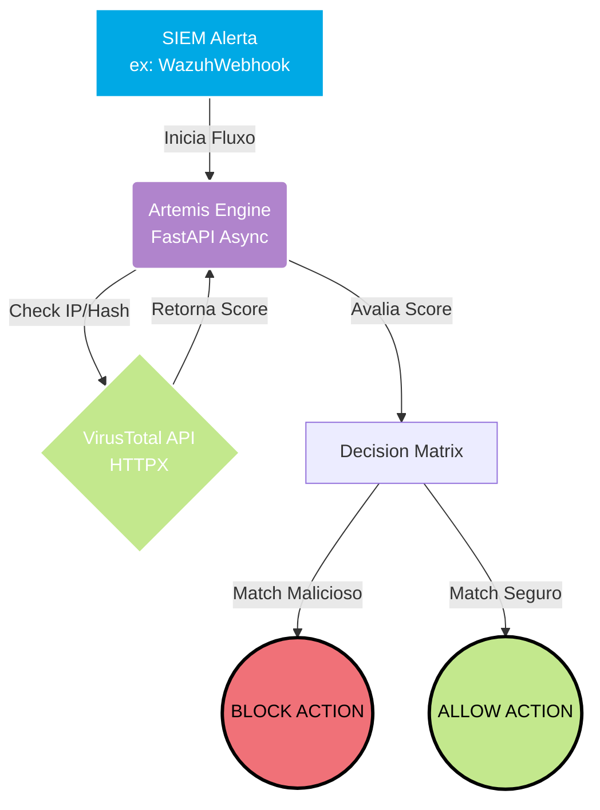

<div align="center">


<br>


</div>

<br>

## 🛡️ Visão Geral

O **Artemis SOAR** é um microserviço de alta performance projetado para orquestração de segurança e enriquecimento de ameaças. Ele atua como uma camada de inteligência intermediária que intercepta e analisa logs do **Wazuh SIEM**, consultando a reputação de artefatos (IPs, Hashes) na API do **VirusTotal** para automatizar a tomada de decisão no SOC.

---

## 🏗️ Fluxo de Arquitetura (Mermaid.js)

O GitHub suporta nativamente diagramas de arquitetura bonitões. Este diagrama mostra o fluxo exato que você construiu:



---

## 🌌 Engenharia do Projeto & Stack

Tabelas HTML invisíveis são o segredo para esse layout de "Tabela Invisível" que você já gosta.

<div align="center">
  <table border="0" style="background-color: transparent;">
    <tr>
      <td align="left" width="55%">
        <h3> ⚡ Core Capabilities </h3>
        <ul>
          <li><b>Async Engine:</b> Construído com FastAPI e HTTPX para processamento não-bloqueante e de alta performance.</li>
          <li><b>Smart Enrichment:</b> Filtra, normaliza e correlaciona dados brutos do SIEM em inteligência tática.</li>
          <li><b>Decision Matrix:</b> Gera vereditos automáticos baseados em scores de reputação personalizáveis.</li>
        </ul>
      </td>
      <td align="center" width="45%">
        <h3> 🛠️ Arsenal Tecnológico </h3>
        <a href="https://skillicons.dev">
          
        </a>
      </td>
    </tr>
  </table>
</div>

<br>

## 🔒 Defense in Depth & Hardening (DevSecOps)

Ao contrário de scripts simples, a Artemis foi projetada sob princípios rigorosos de segurança de infraestrutura:

* 🛡️ **Princípio do Menor Privilégio:** O container é configurado para rodar sob um usuário restrito (`artemisuser`). O processo da API nunca roda como `root`.
* 📦 **Multi-stage build:** A imagem final Docker é otimizada, reduzindo a superfície de ataque ao remover todas as ferramentas de compilação da imagem final.
* 🤖 **Automated SAST:** Pipeline integrada no GitLab que utiliza o **Bandit** para varredura estática, garantindo 0 falhas críticas no código fonte.

---

## 🚀 Deployment & Lab

Unifiquei os blocos de código para ficar mais limpo.

### 🐋 Docker Orchestration

```bash
# 1. Build da imagem Docker blindada e otimizada
docker build -t artemis-soar:latest .

# 2. Deploy com injeção de segredos via ENV
# Lembre-se de substituir 'your_api_key_here' pela sua chave real
docker run -d -p 8000:8000 \
  --name artemis-engine \
  -e VT_API_KEY="your_api_key_here" \
  artemis-soar:latest
```

---

<div align="center">
  <h3> 🔮 Pipeline Insights </h3>
  
  
  <br><br>
  
  <p><i>Desenvolvido como parte do arsenal de defesa de **Victor Ramalho**</i></p>
  
  <a href="https://linkedin.com/in/victor-ramalho-lisboa" target="_blank">
    
  </a>
</div>

<div align="center">
  
</div>
